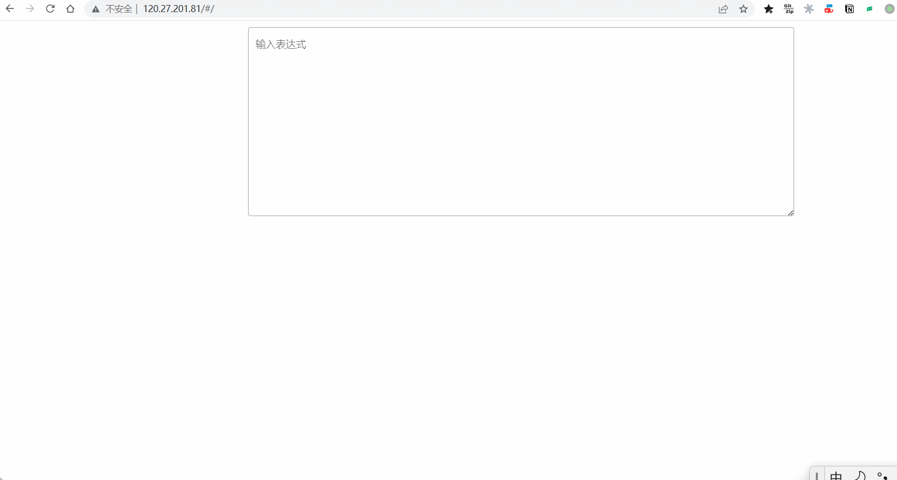
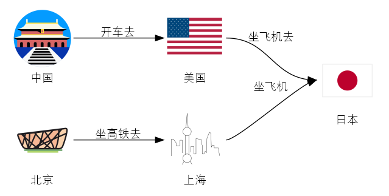
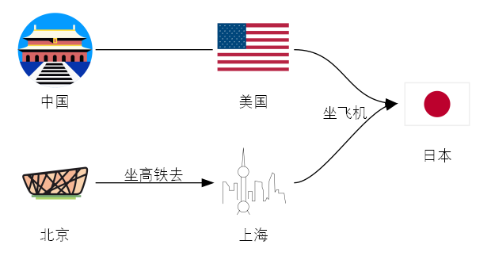

# 这是什么工具？

试用地址：http://47.104.28.107/#/

这是一款自动化画图工具，多说无益请看效果。



总之有以下特色：

- 智能自动化
  - 智能选图
  - 智能布局

- 便捷操作
  - 简单语法
  - 人工选图

# 语法是什么？

语法非常简单，我耍几个例子你就懂了：

```
中国-开车去->美国-坐飞机去->日本

北京-坐高铁去->上海 -坐飞机-> 日本
```



```
中国--美国-->日本

北京-坐高铁去->上海 -坐飞机-> 日本
```



# 其它

后端地址：https://github.com/yuruotong1/graphx_backend