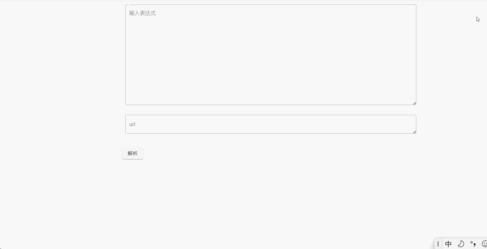
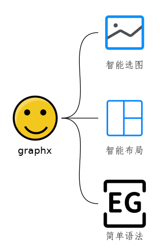

# 这是什么工具？

试用地址：http://120.27.201.81/#/

这是一款自动化画图工具，多说无益请看效果。



总之有以下特色：
    


# 如何使用？

## 语法

语法非常简单，我耍几个例子你就懂了!

```
中国-开车去->美国-坐飞机去->日本

北京-坐高铁去->上海 -坐飞机-> 日本
```


```
中国--美国-->日本

北京-坐高铁去->上海 -坐飞机-> 日本
```


## 修改图片

生成图片后，若发现图片出现**错误**：


有两种修改方法：

1. 将图片 url 复制到浏览器上，然后删除图片 url 结尾的".png"，进行访问
1. 将**图片 url 复制到 graphx 页面的 url 输入框，点击「解析」按钮，即可对图片进行修改！**

比如，graphx 生成了如下图片：


```
http://120.27.201.81:8888/graph/parseBase64?data=eyJzdWNjZXNzIjp0cnVlLCJncmFwaERhdGEiOnsiZWRnZUxpc3QiOlt7InNvdXJjZU5vZGUiOnsiYXZhdGFyIjoiaHR0cHM6Ly9pY29uc2FwaS5jb20vNWVlMjYwNmZlNGIwYjc4OGE5MzI5ZWUxLnN2ZyIsImlkIjoiYyIsInNlYXJjaFBpY3R1cmVOYW1lIjoiYyIsInRleHQiOiJjIn0sInRhcmdldE5vZGUiOnsiYXZhdGFyIjoiaHR0cHM6Ly9pY29uc2FwaS5jb20vNWVlMjYwNmZlNGIwYjc4OGE5MzI5ZWRiLnN2ZyIsImlkIjoiZCIsInNlYXJjaFBpY3R1cmVOYW1lIjoiZCIsInRleHQiOiJkIn0sInRleHQiOiIiLCJ0eXBlIjoiTElORV9MSU5FIn1dLCJub2RlTGlzdCI6W3siJHJlZiI6IiQuZ3JhcGhEYXRhLmVkZ2VMaXN0WzBdLnNvdXJjZU5vZGUifSx7IiRyZWYiOiIkLmdyYXBoRGF0YS5lZGdlTGlzdFswXS50YXJnZXROb2RlIn1dfSwicmF3RGF0YSI6ImMtLWQifQ==.png
```

若想更改该图片，可以在浏览器上访问下面地址（去除 .png）：

```
http://120.27.201.81:8888/graph/parseBase64?data=eyJzdWNjZXNzIjp0cnVlLCJncmFwaERhdGEiOnsiZWRnZUxpc3QiOlt7InNvdXJjZU5vZGUiOnsiYXZhdGFyIjoiaHR0cHM6Ly9pY29uc2FwaS5jb20vNWVlMjYwNmZlNGIwYjc4OGE5MzI5ZWUxLnN2ZyIsImlkIjoiYyIsInNlYXJjaFBpY3R1cmVOYW1lIjoiYyIsInRleHQiOiJjIn0sInRhcmdldE5vZGUiOnsiYXZhdGFyIjoiaHR0cHM6Ly9pY29uc2FwaS5jb20vNWVlMjYwNmZlNGIwYjc4OGE5MzI5ZWRiLnN2ZyIsImlkIjoiZCIsInNlYXJjaFBpY3R1cmVOYW1lIjoiZCIsInRleHQiOiJkIn0sInRleHQiOiIiLCJ0eXBlIjoiTElORV9MSU5FIn1dLCJub2RlTGlzdCI6W3siJHJlZiI6IiQuZ3JhcGhEYXRhLmVkZ2VMaXN0WzBdLnNvdXJjZU5vZGUifSx7IiRyZWYiOiIkLmdyYXBoRGF0YS5lZGdlTGlzdFswXS50YXJnZXROb2RlIn1dfSwicmF3RGF0YSI6ImMtLWQifQ==
```

或者进行下面操作：


graphx 会通过 url，将图片信息还原：


哇，太神奇了！难道 graphx 把图片信息存进了数据库？


graphx 不存储图片，是图片的解析工，图片的相关信息会保存在 URL 中：


# 其它

后端地址：https://github.com/yuruotong1/graphx_backend