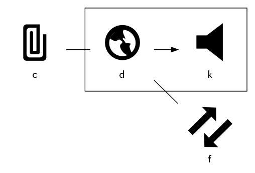

# 这是什么工具？

wiki：https://github.com/yuruotong1/graphx_front_end/wiki

Bilibili视频：https://www.bilibili.com/video/BV1gq4y1i7bB/

试用地址：http://120.27.201.81/#/

这是一款自动化画图工具，具有以下特色：
    


# 如何使用？

## 语法

语法非常简单，我耍几个例子你就懂了!

```
中国-开车去->美国-坐飞机去->日本

北京-坐高铁去->上海 -坐飞机-> 日本
```


```
中国--美国-->日本

北京-坐高铁去->上海 -坐飞机-> 日本
```


### 子结构

可以用表示子结构：

```
c--d
d--f
g {
  d-->k
}
```




## 修改别名

输入下面语法：

```
a--c
```


如果你觉得 'a' 和 'b' 不够具体，可以为图片起个别名：


## 修改图标

输入下面语法：

```
中国--北京
```


如果你对上述图片中的“图标”不满意，可在 graphx 页面进行修改：

点击图标


选择相应的图标即可更换：


## 已经生成的图，如何修改？

生成图片后，若发现图片出现**错误**，有两种修改方法：

1. 将图片 url 复制到浏览器上，然后将图片 url 中的 `/png/` 更改为 `/parse/`，进行访问

比如，graphx 生成了如下图片：


```
http://120.27.201.81:8888/graph/png?data=eyJyYXdEYXRhIjoiYy0tZCIsIm5vZGVMaXN0IjpbeyJhdmF0YXIiOiJodHRwczovL2ljb25zYXBpLmNvbS81ZWUyNjA2ZmU0YjBiNzg4YTkzMjllZTEuc3ZnIiwiaWQiOiJjIiwic2VhcmNoUGljdHVyZU5hbWUiOiJjIiwidGV4dCI6ImMifSx7ImF2YXRhciI6Imh0dHBzOi8vaWNvbnNhcGkuY29tLzVlZTI2MDZmZTRiMGI3ODhhOTMyOWVkYi5zdmciLCJpZCI6ImQiLCJzZWFyY2hQaWN0dXJlTmFtZSI6ImQiLCJ0ZXh0IjoiZCJ9XX0=.png
```

若想更改该图片，可以在浏览器上访问下面地址：

```
http://120.27.201.81:8888/graph/parse?data=eyJyYXdEYXRhIjoiYy0tZCIsIm5vZGVMaXN0IjpbeyJhdmF0YXIiOiJodHRwczovL2ljb25zYXBpLmNvbS81ZWUyNjA2ZmU0YjBiNzg4YTkzMjllZTEuc3ZnIiwiaWQiOiJjIiwic2VhcmNoUGljdHVyZU5hbWUiOiJjIiwidGV4dCI6ImMifSx7ImF2YXRhciI6Imh0dHBzOi8vaWNvbnNhcGkuY29tLzVlZTI2MDZmZTRiMGI3ODhhOTMyOWVkYi5zdmciLCJpZCI6ImQiLCJzZWFyY2hQaWN0dXJlTmFtZSI6ImQiLCJ0ZXh0IjoiZCJ9XX0=.png
```

哇，太神奇了！难道 graphx 把图片信息存进了数据库？不，不是的！

graphx 不存储图片，是图片的「解析工」，图片的相关信息会保存在 URL 中，工作原理如下：


若我提供的 graphx 服务器挂掉，你也可以手动部署服务器，该服务器也可解析图片！


# 其它

后端地址：https://github.com/yuruotong1/graphx_backend


